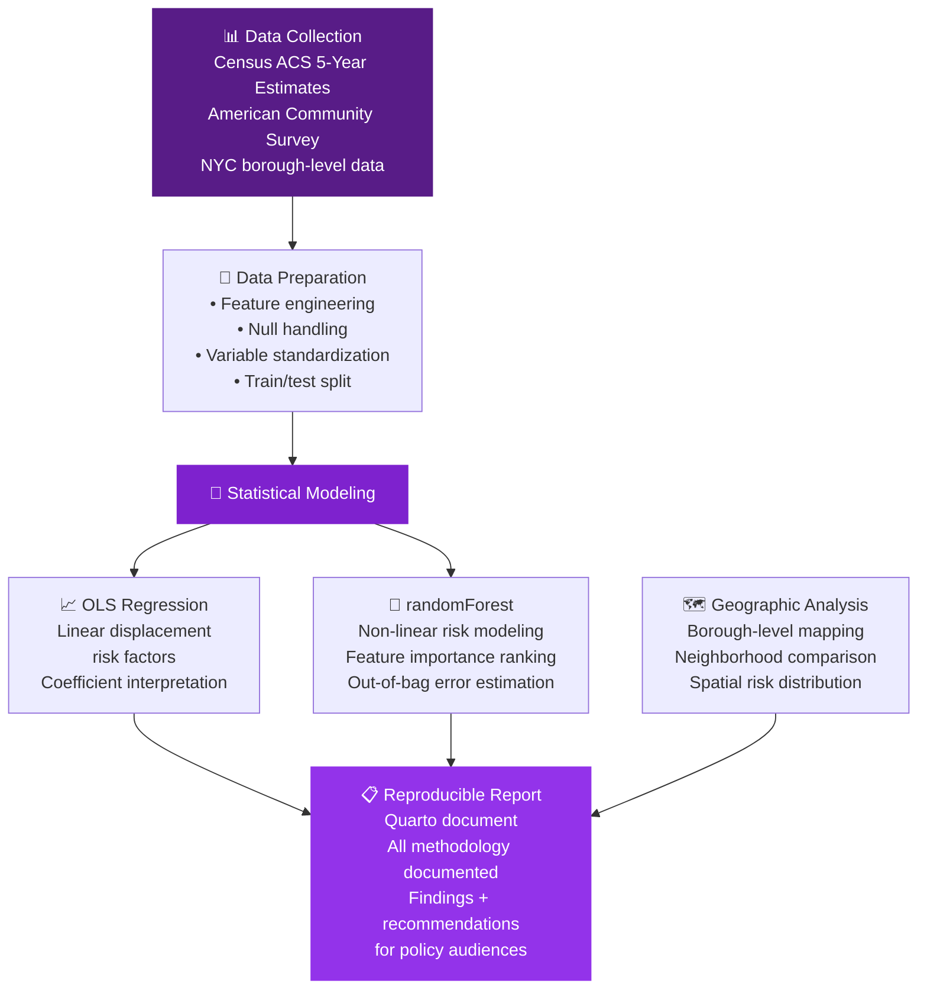

<div align="center">


<br/>

[](https://github.com/yashxsainix/STA9750-2025-FALL)

<br/>

[](https://www.r-project.org)
[](https://quarto.org)
[](https://cran.r-project.org/web/packages/randomForest)
[](https://www.census.gov/programs-surveys/acs)

<br/>


</div>

---

## 🏙️ The Question

New York City has been changing for decades. Neighborhoods gentrify. Longtime residents move out. Communities that built a borough over generations find themselves displaced by rising rents and shifting economic pressures.

This project asks: **which NYC neighborhoods are at the highest risk of displacement, and what demographic and economic factors predict that risk?**

The answer matters for policy, for housing advocacy, and for anyone trying to understand how the city is changing.

---

## 🔬 Methodology



---

## 📊 Variables Analyzed

<details>
<summary><b>🏘️ Housing Indicators</b></summary>

- Median gross rent as a percentage of household income
- Renter-occupied housing unit percentage
- Housing unit vacancy rate
- Median home value
- Rent burden (>30% of income on housing)
- Severe rent burden (>50% of income on housing)

</details>

<details>
<summary><b>👥 Demographic Indicators</b></summary>

- Racial and ethnic composition by census tract
- Percentage of foreign-born residents
- Educational attainment distribution
- Median household income
- Poverty rate
- Population change over time

</details>

<details>
<summary><b>📈 Economic Indicators</b></summary>

- Unemployment rate
- Median household income trend
- Income inequality (Gini coefficient)
- Industry employment distribution
- Commute time (proxy for accessibility)

</details>

---

## 🌲 Why randomForest

OLS regression gives interpretable coefficients — useful for policy communication. But displacement risk is not necessarily linear. Neighborhoods with moderate values across several risk factors may be at higher actual risk than neighborhoods with one extreme indicator.

randomForest captures these interaction effects without requiring you to specify them explicitly. The model's **variable importance output** then tells you which factors contributed most to predictive accuracy — giving you the non-linear insight alongside the interpretable regression results.

```r
# Model training
library(randomForest)

rf_model <- randomForest(
  displacement_risk ~ median_rent_burden + pct_renters + 
                      income_change + pct_poc + vacancy_rate,
  data = train_data,
  ntree = 500,
  importance = TRUE
)

# Variable importance
varImpPlot(rf_model)
```

---

## 📋 The Reproducible Report

Every finding in this analysis is reproducible. The Quarto document includes:

- All data sources with links and access dates
- Full data cleaning and transformation code
- Model specifications and parameter choices
- Diagnostic plots and residual analysis
- Interpretation guidance for policy audiences
- Limitations section with clear caveats

The goal is that another researcher could take this document, run it on updated ACS data, and produce a current analysis without guessing what was done or why.

---

## 🗂️ Repository Structure

```
STA9750-2025-FALL/
│
├── analysis/
│   ├── housing_equity_analysis.qmd    ← Main Quarto document
│   └── housing_equity_analysis.html   ← Rendered report
│
├── data/
│   ├── raw/                           ← ACS/Census downloads
│   └── processed/                     ← Cleaned analysis-ready data
│
├── R/
│   ├── data_prep.R                    ← Cleaning functions
│   ├── modeling.R                     ← Regression + randomForest
│   └── visualization.R               ← Charts and maps
│
└── outputs/
    ├── figures/                       ← All plots
    └── tables/                        ← Summary statistics
```

---

## 🚀 How to Run

```r
# Install required packages
install.packages(c("tidyverse", "randomForest", "tidycensus", "quarto"))

# Set Census API key
tidycensus::census_api_key("YOUR_KEY_HERE", install = TRUE)

# Render the full analysis
quarto::quarto_render("analysis/housing_equity_analysis.qmd")
```

---

## 💡 Why This Matters

Data analysis in service of equity is one of the most valuable applications of statistical methodology. This project demonstrates that the same tools used for financial modeling and business analytics can be turned toward understanding how communities change and how policy decisions affect real people.

The technical skills are identical. The stakes are different.

---

## 👤 Author

**Yashpal Saini** · [LinkedIn](https://linkedin.com/in/yash-saini-analyst) · [Portfolio](https://yashxsainix.github.io)


